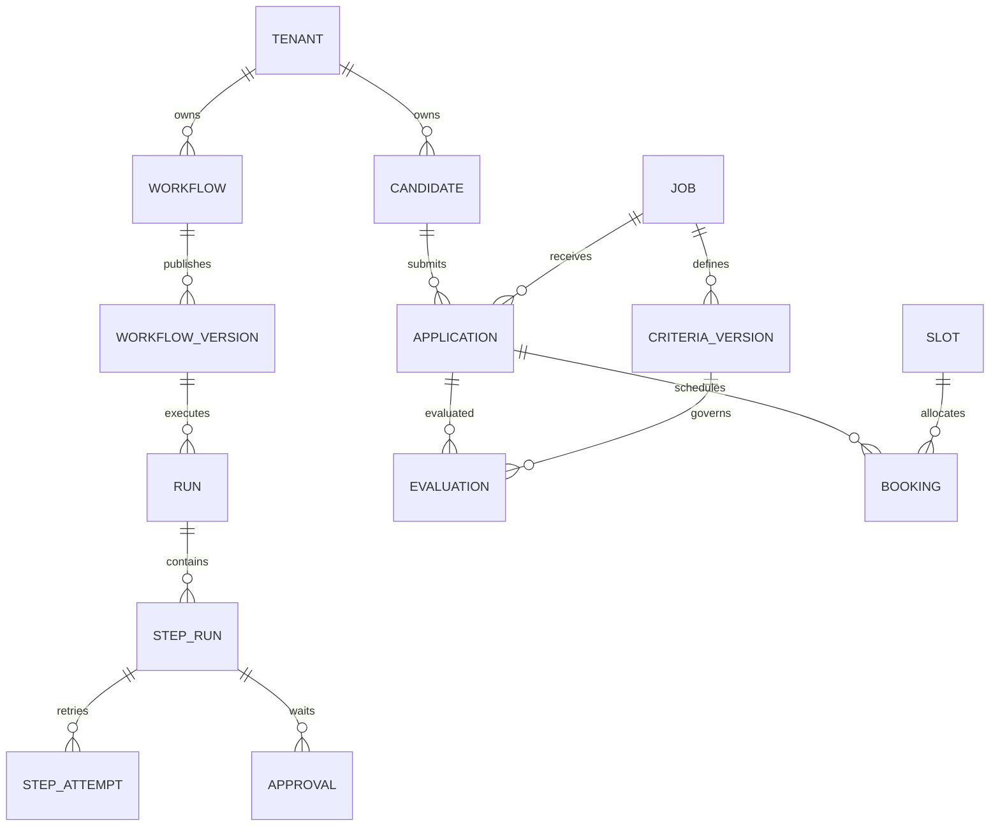

# Backend, Database, Storage and Auth

## 1. Backend design goal
Core độc lập HR; tất cả dữ liệu doanh nghiệp thuộc tenant; version bất biến; approval/action/booking không bị lặp do concurrency. DB là nguồn trạng thái, queue chỉ vận chuyển tác vụ.

## Workspace model
Giữ tên kỹ thuật tenants/tenant_id để tránh đổi contract không cần thiết; tenant là workspace. Bổ sung kind personal/team, owner_user_id; name/timezone/status áp dụng cả hai. Personal có một Owner và không yêu cầu thông tin doanh nghiệp. Team có membership/role/scope. Chuyển loại workspace phải giữ resource ownership, credential grants và audit; chưa triển khai migration.

## 2. Directory structure
Giữ `apps/api/app/core`, `modules`, `shared`, `apps/api/tests`, `alembic/versions` theo sườn. Các README module là hợp đồng triển khai, chưa phải API code.

## 3. Domain modules
| Module | Responsibility | Main entities | Main permissions |
|---|---|---|---|
| identity | Tenant/membership/session | Tenant, User, Membership | members.manage |
| connections | Credential và subscription | Connection, IngressEvent | connections.manage/use |
| registry | Manifest node | ModuleDefinition | modules.read/register |
| workflows | Draft/version | Workflow, WorkflowVersion | workflows.edit/publish |
| executions | Run/step/attempt/outbox | Run, Step, Attempt, Outbox | runs.start/read/cancel |
| approvals | Quyết định con người | Approval, Decision | approvals.decide |
| files | Tệp và extraction | File, Extraction | files.read/upload |
| notifications | Email/tin nhắn | Message, DeliveryAttempt | messages.send |
| scheduling | Slot và booking | Slot, Booking | slots.manage/book |
| analytics/audit | Chỉ số và truy vết | AuditEvent | analytics.read/audit.read |
| hr | Vị trí và đơn tuyển dụng | Job, Candidate, Application, CriteriaVersion, Evaluation | hr.read/write/review |

## 4. Entity map

Sơ đồ rút gọn; bảng doanh nghiệp trong mục 5 đều có tenant_id, kể cả khi không vẽ quan hệ tenant.

## 5. Core tables/entities
Quy ước: UUID id; created_at/updated_at UTC; tenant_id với composite FK cho bảng thuộc tenant. State enum kiểm tra phía DB/service. User toàn cục không chứa dữ liệu HR; membership liên kết tenant.

| Entity | Main fields/relations | Uniqueness/index | Retention/deletion |
|---|---|---|---|
| tenants | name, timezone, status, retention_policy | id | vô hiệu hóa trước purge có kiểm soát |
| users/memberships | user identity; tenant/user/role/scope | tenant,user,role,scope | revoke session khi vô hiệu hóa |
| connections | provider, credential_ref, status, scopes | tenant,provider; credential không trong graph | revoke + xóa secret theo policy |
| ingress_events | connection, external_event_id, received_at, payload_ref | tenant,connection,external_event_id UNIQUE | TTL cấu hình sau cửa sổ dedup |
| module_definitions | type, version, manifest | type,version UNIQUE; global hoặc tenant-scoped | giữ khi version workflow còn tham chiếu |
| workflows | name, department, draft_graph, revision, status | tenant,updated_at | archive thay xóa run đang hoạt động |
| workflow_versions | workflow_id, number, graph, hash, published_by | tenant,workflow,number UNIQUE | bất biến, giữ cùng runs |
| runs | workflow_version_id, trigger_event_id, status, principal, started_at | tenant,status,created_at; event+subscription UNIQUE | purge theo retention run |
| step_runs/attempts | run,node_id,status,output_ref; attempt_no,lease,fence,error | run,node UNIQUE; step,attempt_no UNIQUE | output nhạy cảm có TTL riêng |
| approvals/decisions | step, payload_hash, snapshot_ref, scope, expires_at, decision | step,request_key UNIQUE; approval decision UNIQUE | giữ audit tối thiểu, xóa PII theo policy |
| outbox/action_receipts | action_key,payload_ref,status,provider_id | tenant,action_key UNIQUE | giữ đủ thời gian chống lặp/đối soát |
| files/extractions | object_key,hash,mime,size,status; extractor_version,content_ref | tenant,hash; tenant,object_key UNIQUE | purge cả object/extraction sau kiểm tra references |
| hr_jobs | title,JD,status,department | tenant,status | archive |
| hr_candidates | contact,name,merge_state | tenant,normalized_email/phone indexes | không UNIQUE tên; purge theo policy |
| hr_applications | candidate,job,attempt_no,status,source | tenant,candidate,job,attempt_no UNIQUE | lưu lịch sử tái ứng tuyển rõ ràng |
| hr_application_files | application,file,kind | tenant,application,file UNIQUE | xóa liên kết không xóa tệp còn tham chiếu |
| hr_criteria_versions | job,version,rules,published_by | tenant,job,version UNIQUE | bất biến |
| hr_evaluations | application,criteria_version,model,prompt_version,result,evidence,status | tenant,application,created_at | quyết định cũ không ghi đè |
| conversations/messages | application/contact,channel,direction,event_key,delivery_status | tenant,channel,event_key UNIQUE khi có | retention hội thoại cấu hình |
| form_tokens | token_hash,application,scope,expires_at,used_at | token_hash UNIQUE | hết hạn/revoke, không lưu raw token |
| slots/bookings | start/end UTC,timezone,capacity; slot,application,status | slot,status; application,slot active UNIQUE | không hard-delete booking đã xác nhận |
| audit_events | actor,resource,action,redacted_delta,correlation | tenant,created_at/resource | append-only; retention riêng |

Bảng scope và membership có thể chuẩn hóa thêm khi triển khai. Dữ liệu PII không sao chép rộng vào JSON logs. Không tự merge ứng viên chỉ vì file hash giống.

## 6. Authentication flow
Web dùng session HttpOnly; login rate limit; hash mật khẩu bằng thư viện chuyên dụng khi triển khai; session expiry/revoke; CSRF cho mutation cookie. OAuth connector lưu server-side, state/nonce/redirect allowlist; ứng viên dùng token form có scope và expiry, không có quyền workspace.

## 7. Authorization rules
RBAC: Admin quản trị; Builder edit/publish theo scope; Operator vận hành; Reviewer duyệt trong job được giao; Viewer chỉ đọc. Context: cùng tenant, department/job/workflow scope, credential use grant, approval assigned scope. Server và worker kiểm tra; không suy quyền từ nút UI. Service principal workflow có quyền tối thiểu, không dùng mặc định quyền Owner.

## 8. Transaction boundaries
Publish kiểm revision + insert immutable version + audit. Intake insert event + outbox. Approval compare pending + decision + wakeup outbox. Action enqueue ghi receipt/outbox cùng transaction; HTTP provider ngoài transaction, cập nhật receipt sau. Booking khóa slot + kiểm capacity + insert booking + notification outbox. Candidate merge chỉ thao tác HR có preview và transaction giữ application history.

## 9. Concurrency controls
Row lock/CAS cho approval, lease+fencing cho worker, optimistic revision cho canvas. Unique keys cho event và action; khóa slot khi giữ chỗ. Bulk approve trả trạng thái từng item, không báo toàn bộ thành công khi có conflict. Provider không có idempotency cần delivery_unknown và đối soát trước resend.

## 10. Indexes and performance
Index theo tenant,status,created_at cho list/run; foreign keys composite; contact normalized cho tra cứu. Cursor pagination ổn định `(created_at,id)`. Đo query trước index JSONB/partition. Dashboard tổng hợp từ event/domain không đếm retry như hồ sơ mới.

## 11. Data retention and deletion
Chưa chốt số ngày. Trước production Admin phải chọn policy hồ sơ, tệp, run, log và backup; workflow đang giữ PII phải áp dụng cùng chính sách. Xóa/anonymize dữ liệu dẫn xuất, object, form token và cache; audit chỉ giữ dữ liệu tối thiểu. Backup hết hạn theo lịch đã xác nhận. Không tuyên bố tuân thủ pháp lý khi chưa đánh giá phạm vi triển khai.

## 12. Seed/demo data
Dữ liệu hoàn toàn giả: hai tenant; Admin/Builder/Reviewer/Viewer; hai job; năm CV tình huống trong application flow; slot một chỗ; expired connection; pending approval. Không có hồ sơ cá nhân thật trong sườn. Seed code sẽ làm ở phase backend.
