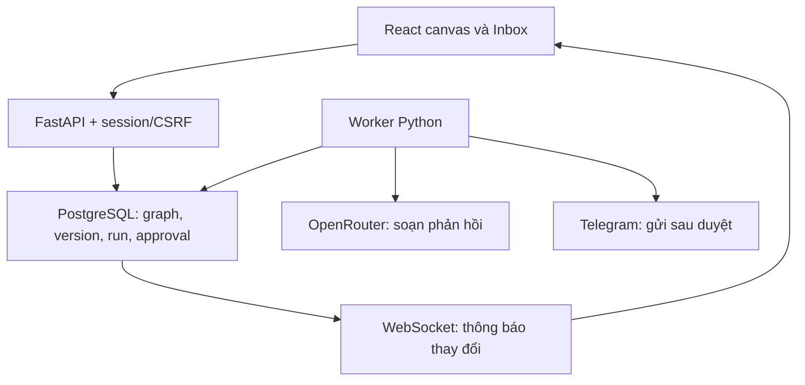

# Flowvia Lite 0.3.0 — triển khai và nghiệm thu

Ngày: 2026-09-10. Baseline GitHub: `be561dab784579df7e2f2546f8078036cd9d8e40` (M1). Có đối chiếu artifact M2 trước đây; không coi lịch sử trò chuyện truy xuất được là toàn bộ hai cuộc trò chuyện.

## Quyết định kiến trúc hiện hành

- Giữ React/TypeScript, FastAPI, SQLAlchemy/Alembic và PostgreSQL theo blueprint. Chưa chuyển Supabase và chưa phụ thuộc gói hosted miễn phí.
- Lite dùng PostgreSQL làm hàng đợi, worker Python riêng với `FOR UPDATE SKIP LOCKED`. Redis/Celery là hướng mở rộng khi có nhu cầu thông lượng; không chạy hai queue song song trong bản này.
- SQLite dùng cho kiểm thử cô lập. PostgreSQL mới là đích vận hành. SQLite không chứng minh được semantics khóa đồng thời của PostgreSQL.
- Một graph có một trigger, tối đa 50 node/100 edge, DAG, mỗi cổng ra nối một bước tiếp theo. If/Else chọn đúng một nhánh. Các đường có thể hội tụ theo nhánh đã chọn; chưa có parallel fan-out, join đợi nhiều nhánh, loop hoặc subworkflow.
- Cấu hình draft có schema về hình dạng; publish kiểm tra graph, cổng và tài nguyên cùng workspace. Config handler có schema/version riêng; không dùng eval.
- Mapping đọc `input`, `data`, `steps` bằng đường dẫn, ví dụ `{{ input.body }}`, `{{ steps.agent.reply }}`. Không có truy cập shell, mạng tùy ý hoặc Python trong mapping.

## Phiên bản, worker và tác dụng phụ

Draft có số revision để phát hiện ghi đè từ tab khác. Save đánh dấu draft, không đổi phiên bản đang phát hành. Publish chụp graph và cấu hình agent thành phiên bản mới. Mỗi run ghim version ID; sửa draft hoặc cấu hình agent không làm đổi run đang chạy. Cần publish lại để dùng model/instructions mới.

Test trên canvas tự lưu và phát hành nếu draft đã thay đổi, rồi chạy đúng version đó. Hộp thoại thông báo điều này, vì workflow đang bật sẽ nhận bản phát hành mới cho tin nhắn tiếp theo. Khi workflow đang chạy live, chỉ owner được phát hành vào subscription live.

Worker commit sau mỗi bước; `waiting_human` nằm trong DB, không giữ tiến trình đợi. Approval chứa hash của action, recipient, message, connection/credential reference và mode. Owner/reviewer quyết định bằng compare-and-set; bấm duyệt lại cùng quyết định không tạo action mới. Worker kiểm tra lại quyền của người tạo, trạng thái credential và nội dung đã duyệt trước khi gửi.

Gửi Telegram có hai giai đoạn: ghi delivery pending, rồi commit trạng thái dispatching trước khi gọi mạng. Chỉ đánh dấu sent khi có message receipt. Timeout, receipt không đọc được hoặc worker dừng giữa lúc gửi dẫn tới `delivery_unknown`. Không tự retry trạng thái này vì Telegram sendMessage không cung cấp idempotency key cho Flowvia. Owner phải kiểm tra cuộc trò chuyện trước khi cân nhắc tạo một lượt gửi mới. Lite chưa có màn hình đối soát receipt riêng.

Run API yêu cầu `Idempotency-Key`; dùng lại key với payload khác trả 409. Ingress chống trùng bằng connection + update ID; lưu message và offset trong cùng transaction trước lần lấy batch tiếp theo.

AI không có quyền gọi tool hoặc tự gửi. Output phải đúng schema summary/intent/reply. Dry run không gọi OpenRouter hoặc gửi Telegram. Live AI có thể phát sinh chi phí; chưa có quota ledger. Nếu worker chết sau khi model đã trả lời nhưng trước commit, bước AI có thể bị gọi lại và tính phí lại; cơ chế không gửi trùng của Telegram không bảo đảm exactly-once cho tính phí model.

## Các màn hình đã nối API

| Màn hình | Thao tác |
| --- | --- |
| Workflows | Thêm/sửa/nối/xóa node, save, validate, publish, import/export Flowvia JSON, chọn mode và bật/tắt nhận tin |
| Inbox | Dữ liệu DB, lọc kênh/tìm tin, đánh dấu đã đọc, thêm tin demo, chạy thử qua workflow |
| Agents | Sửa instructions, model ID, gắn OpenRouter credential |
| Connections | Lưu token vào vault, gắn Telegram credential, kiểm tra bot, sync và polling |
| Runs | Lịch sử thật, phiên bản đã chạy, Input/Output/error từng node, duyệt/từ chối/hủy |
| Overview/Analytics | Thống kê SQL theo workspace và timezone; không tạo số liệu run giả |
| Settings | Xem policy outbound và thu hồi credential |

Danh sách Lite giới hạn tối đa 100–200 bản ghi mới nhất theo endpoint; chưa có pagination UI đầy đủ. WebSocket có cursor DB và kiểm tra session/workspace lại trong suốt kết nối. Client tải lại trạng thái sau sự kiện, khi quay lại tab và mỗi 15 giây. Event cursor không thay thế truy vấn trạng thái DB, đặc biệt khi nhiều transaction commit khác thứ tự cấp ID. Chưa có retention job cho history/event.

## Telegram va OpenRouter

### Dry run

Đăng nhập owner, mở workflow Telegram mặc định, bấm Test workflow → Dry run → Run workflow. Tại Review reply bấm Approve test. Run phải succeeded và output gửi có `sent: false`, `simulated: true`.

### Kết nối bot

1. Tạo bot qua BotFather và lấy token cho bot do bạn quản lý.
2. Connections → Telegram → Configure: nhập token, lưu, rồi Test connection. API getMe xác minh danh tính bot; token không hiển thị lại.
3. Gửi một tin nhắn văn bản cho bot. Chọn Sync inbox để lấy tin. Chỉ có text messages trong phạm vi Bot API; file/ảnh và lịch sử tài khoản cá nhân chưa hỗ trợ.
4. Nếu muốn tự nhận, bật polling trong cấu hình connection. Chỉ dùng một bộ lấy getUpdates cho bot; bot không thể đồng thời dùng webhook Telegram và polling.
5. Mở workflow, kiểm tra cả trigger và send dùng đúng connection, Publish. Chọn mode khi workflow đang tắt, rồi bật toggle để nhận tin tiếp theo.

`OUTBOUND_MODE=dry_run` chỉ chặn thực thi AI/gửi tin ra ngoài. Khi owner đã cấu hình bot và bấm Test/Sync hoặc bật polling, ứng dụng vẫn gọi Telegram để xác minh/nhận tin. Label dry run trên run không có nghĩa toàn server ngắt mọi kết nối mạng.

Webhook API có đường dẫn `/api/v1/ingress/telegram/{connection_id}`, kiểm tra header `X-Telegram-Bot-Api-Secret-Token`. Có thể đặt `webhook_secret` qua connection API; đây chưa phải luồng cài webhook hoàn chỉnh trên UI. Cần HTTPS và đăng ký webhook tại Telegram khi triển khai sau. Không đưa secret vào URL. Bot token thuộc quyền của chủ bot; polling bot đã dùng ở nơi khác có thể tiêu thụ update mà ứng dụng kia đang chờ.

### Dùng model và gửi thật

1. Agents → Inbox assistant: nhập model ID có hỗ trợ structured output và OpenRouter API key, lưu. Không tự chọn gói trả phí hoặc cam kết model miễn phí.
2. Publish lại workflow để ghim cấu hình agent mới.
3. Trong `.env`, đổi `OUTBOUND_MODE=live`, rồi chạy `docker compose up -d --force-recreate api worker`. Thao tác này không xóa volume.
4. Chạy Test workflow ở **Live** với chat ID của người đã nhắn cho bot. AI thật soạn phản hồi; bạn đọc và duyệt recipient/message trước khi gửi.
5. Muốn workflow tự xử lý tin mới: pause toggle, chọn Live, bật lại. Mỗi tin vẫn dừng ở Human approval.

Nếu đổi credential sau khi đã duyệt, action cũ sẽ thất bại thay vì âm thầm gửi bằng tài khoản khác. Khi có `delivery_unknown`, kiểm tra Telegram trước; không bấm chạy lại chỉ vì chưa thấy receipt trong UI.

## Kiểm thử nghiệm thu trên máy Windows

Khởi động bằng `scripts/start.ps1`, sau đó chạy `scripts/verify.ps1`.

1. Đăng nhập owner, đổi personal/team. Dữ liệu phải đổi theo workspace.
2. Kéo node, nối nhánh true/false, sửa Edit fields, Save/Publish. JSON sai phải có lỗi; graph có chu trình không được publish.
3. Chạy hai template mặc định ở dry run; kiểm tra input/output và approval. Theo dõi trạng thái tự cập nhật.
4. Khi run waiting_human, chạy `docker compose restart worker api`. Refresh, duyệt run cũ và kiểm tra nó hoàn tất đúng một lần.
5. Đăng nhập reviewer/viewer trong trình duyệt riêng, chọn team. Reviewer duyệt được; viewer không sửa/chạy workflow.
6. Mở cửa sổ desktop và mobile. Kiểm tra menu, canvas, inspector, dialog, scroll và bàn phím. Bước này chưa được xác minh trong phiên phát triển do preview bị chặn.
7. Nếu bạn cung cấp credential, chạy phần Live với bot thử nghiệm do bạn kiểm soát. Kiểm tra đúng recipient và đúng một tin gửi.

Xem log: `docker compose logs --tail 100 api worker web`. Nếu health/readiness không đạt, `start.ps1` báo lỗi thay vì in thông báo đã khởi động thành công.

## Bằng chứng đã có

- 35 backend tests pass trên SQLite bật foreign key, trong đó có worker subprocess thực bị kill khi đang waiting_human rồi restart, tiếp tục run đã ghim version.
- Test cho CSRF/session, quyền và tenant, DB composite foreign key, conflict revision, idempotency, graph sai, nhánh điều kiện, chờ duyệt/hủy, provider timeout, đổi/thu hồi credential, ingress dedup, WebSocket origin/revocation và structured output sai.
- SQLite migration head, seed lặp hai lần, Alembic metadata check, downgrade về M2 rồi upgrade lại: pass. PostgreSQL DDL offline: pass.
- TypeScript/Vite build: pass. Lockfile frontend được commit cùng source; Docker và CI dùng npm ci.
- Chưa chạy Docker/PostgreSQL thật, PowerShell, GitHub CI, browser QA hoặc provider live. Đây là gate nghiệm thu còn mở, không phải lỗi đã xác nhận của ứng dụng.

Môi trường browser báo `net::ERR_BLOCKED_BY_CLIENT` với preview đang chạy. Không đổi domain/port để vượt giới hạn; chưa có ảnh chụp giao diện đã kiểm chứng. Bản này chưa được publish hoặc push trong phiên phát triển, theo yêu cầu thử trước.

## Thay đổi schema và nâng cấp

Migrations theo thứ tự M1 → M2 `20260908_0002` → runtime `20260910_0003`. Migration runtime thêm credentials, workflow_versions, workflow_runs, run_steps, approvals, deliveries, runtime_events cùng ràng buộc tenant và idempotency.

Nâng cấp giữ dữ liệu M1/M2 và thêm hai template mới khi chưa tồn tại. Seed không ghi đè draft/agent đã chỉnh. Các bản preview cũ và history minh họa của M2 có thể vẫn còn trong bảng legacy; trang Runs mới chỉ đọc runtime history thật. Canvas cũ dùng node ngoài registry Lite cần được sửa hoặc thay bằng template mới trước khi publish. Không chạy downgrade trên dữ liệu cần giữ: downgrade xóa bảng runtime và credential.

## Gate tiếp theo

Trước khi đánh dấu M2 Done: hoàn thành Docker/PostgreSQL, CI và browser acceptance. Trước public beta: đăng ký/invite/password reset, TLS/secret management, tenant quota/cost ledger, provider backoff, worker lease/observability ở quy mô nhiều workspace, pagination/retention, backup/restore và load testing.

Sau đó mới triển khai HR pack: intake/file parsing, tiêu chí do người dùng khai báo, trích xuất có bằng chứng, danh sách cần người duyệt; không tự loại ứng viên. Email và booking chỉ triển khai khi quyền tài khoản, idempotency và capacity rules đã rõ.

## Tài liệu provider tham khảo

- Telegram Bot API: https://core.telegram.org/bots/api
- Telegram FAQ: https://core.telegram.org/bots/faq
- OpenRouter structured outputs: https://openrouter.ai/docs/features/structured-outputs
- FastAPI WebSockets: https://fastapi.tiangolo.com/advanced/websockets/
- React Flow: https://reactflow.dev/learn
